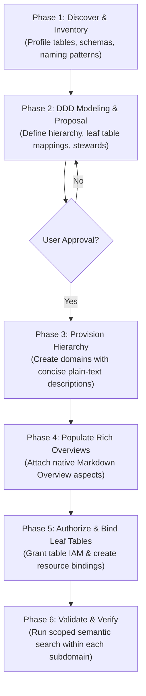

# Knowledge Catalog Data Domain Builder & Logical Ownership Mapping

## TL;DR
This skill provides automated guidance, architectural heuristics, and a dedicated CLI utility (`domain_manager.py`) for creating, managing, authorizing, and binding Dataplex Data Domains and Subdomains in Google Cloud Knowledge Catalog. It applies Domain-Driven Design (DDD) principles to organize physical data assets into clear, bounded business domains, enforcing **lowest-level subdomain resource allocation**, **concise plain-text descriptions**, and **rich native Markdown Overviews**.

---

## 🧠 Architectural Principles & Golden Rules

When requested to **"look at tables/datasets and group them into logical domains,"** act as a Principal Data Architect applying **Domain-Driven Design (DDD)** principles.

### 📋 Core Rules & Heuristics

1. **Lowest-Level (Leaf) Binding Rule (CRITICAL)**:
   * **Rule**: Physical data resources (tables, views, models, buckets) MUST ALWAYS be mapped and bound to the **lowest-level (leaf) subdomain**, where specific operational and business accountability sits.
   * **Container/Parent Domains**: Parent domains serve exclusively as organizational, strategic, and governance umbrellas. **Never bind physical resources directly to a parent domain if child subdomains exist**. This prevents 1:1 binding exclusivity collisions and ensures granular governance.
2. **Monolithic & Shared Datasets (In-Place Governance)**:
   * **Rule**: In real-world enterprise data warehouses, multiple disparate business entities frequently reside in a single physical BigQuery dataset. **Do NOT physically move, split, or duplicate datasets/tables.**
   * **Execution**: Keep physical data in place. Map and bind **individual BigQuery tables** directly to their specialized subdomains via table-level metadata authorization and resource bindings.
3. **Dual-Documentation Standard (Description vs Overview)**:
   * **`description` (Plain Text)**: Always provide a concise, 1–2 sentence plain-text summary (no Markdown, no HTML, no lengthy bulleted lists). Used for high-level search result cards, entry cards, and navigation trees.
   * **`Overview` Aspect (Rich Markdown)**: Always attach the native Knowledge Catalog Overview aspect (`655216118709.global.overview` or `dataplex-types.global.overview`) with `contentType: "MARKDOWN"`. Must contain executive summaries, bound data asset catalogs, key analytical use cases, and data stewardship details.
4. **Identify the Bounded Context**:
   * **Source-Oriented Domains**: Upstream operational processes that generate data (e.g., `Order Processing`, `Inventory Log`, `Supply Chain`).
   * **Consumer-Oriented Domains**: Downstream analytical capabilities that consume data (e.g., `Customer 360`, `Marketing Science`, `Executive Analytics`).
5. **Dataplex Structural Constraints**:
   * Maximum nesting depth: **5 levels**.
   * Maximum direct subdomains per parent: **50**.
   * 1:1 Resource Binding: A table or dataset URI can belong to only **one** domain across the entire catalog.

---

## 🛠️ Operational Playbook & CLI Tool (`domain_manager.py`)

The skill includes a Python script `domain_manager.py` that interacts directly with the Dataplex REST API (`https://dataplex.googleapis.com/v1`) and BigQuery IAM APIs.

The agent invokes this tool using `run_command`:
```bash
uv run --with requests --with google-auth python3 domain_manager.py <subcommand> [options]
```

### CLI Command Summary
* **Domain & Subdomain Management**: `list-domains`, `create-domain`, `create-subdomain`, `get-domain`, `list-subdomains`, `update-domain`, `delete-domain`
* **Overview Aspect Documentation**: `set-overview` (`--content_type=MARKDOWN` or `HTML`), `get-overview`
* **IAM & Access Control**: `get-iam-policy`, `set-iam-policy`, `add-iam-member`
* **Resource Binding & Authorization**: `get-domain-principal`, `authorize-dataset`, `authorize-table`, `bind-resource`, `list-bindings`, `unbind-resource`
* **Discovery & Search**: `search-entries`

---

## 📖 End-to-End Autonomous Domain Build Protocol

When scaffolding a data domain hierarchy from scratch, execute this standard 6-phase lifecycle:



### Phase 1: Asset Inventory Discovery
1. Discover all tables and datasets in the target project using BigQuery tools (`list_dataset_ids`, `list_table_ids`, `get_dataset_info`).
2. Analyze table schemas, column names, data classifications, and existing descriptions to understand the data semantics.

### Phase 2: DDD Modeling & Proposal
1. Organize the discovered tables into a cohesive Parent Domain and specialized Subdomains.
2. Formulate metadata for every domain node:
   * **Domain / Subdomain ID**: kebab-case (e.g., `customer-experience`, `product-inventory`).
   * **Display Name**: Clean business title (e.g., "Customer Experience & Engagement").
   * **Description**: 1–2 sentence plain-text summary.
   * **Overview Content**: Structured Markdown documentation covering executive scope, bound table index, and analytical use cases.
   * **Assigned Tables**: Exact list of physical tables allocated to each leaf subdomain.
   * **Steward/Owner**: Identity, role, and contact email.
3. Present the proposal table to the user:
   | Level | Domain ID | Display Name | Short Description | Bound Tables | Primary Use Cases |
   | :--- | :--- | :--- | :--- | :--- | :--- |
4. **STOP and obtain explicit user approval** before executing API calls.

### Phase 3: Provision Hierarchy & Plain-Text Descriptions
Execute domain and subdomain creation with clean, concise plain-text descriptions:
```bash
# 1. Create Parent Domain
python3 domain_manager.py create-domain \
  --project_id=<project> \
  --location=<location> \
  --domain_id=<parent-id> \
  --display_name="<Parent Display Name>" \
  --description="<1-2 sentence plain text description>" \
  --contact_name="<Owner Name>" \
  --contact_role="owner" \
  --contact_email="<owner@example.com>"

# 2. Create Leaf Subdomains
python3 domain_manager.py create-subdomain \
  --project_id=<project> \
  --location=<location> \
  --domain_id=<subdomain-id> \
  --parent_domain_id=<parent-id> \
  --display_name="<Subdomain Display Name>" \
  --description="<1-2 sentence plain text description>" \
  --contact_name="<Owner Name>" \
  --contact_role="owner" \
  --contact_email="<owner@example.com>"
```

### Phase 4: Populate Native Markdown Overviews
Attach the native Knowledge Catalog Overview aspect (`contentType: "MARKDOWN"`) to the parent domain and every child subdomain:
```bash
# Set Overview on Parent Domain
python3 domain_manager.py set-overview \
  --project_id=<project> \
  --location=<location> \
  --domain_id=<parent-id> \
  --content="# <Parent Name> Overview\n\n## Executive Summary\n...\n\n## Subdomain Hierarchy\n..." \
  --content_type=MARKDOWN

# Set Overview on Leaf Subdomain
python3 domain_manager.py set-overview \
  --project_id=<project> \
  --location=<location> \
  --domain_id=<subdomain-id> \
  --content="# <Subdomain Name> Overview\n\n## Scope\n...\n\n## Bound Data Assets\n• `table_a`: ...\n• `table_b`: ...\n\n## Key Analytical Use Cases\n..." \
  --content_type=MARKDOWN
```

### Phase 5: Authorize & Bind Leaf Resources
For each leaf subdomain, bind its assigned physical tables:
```bash
# 1. Retrieve the Subdomain's Principal
python3 domain_manager.py get-domain-principal \
  --project_id=<project> \
  --location=<location> \
  --domain_id=<subdomain-id>

# 2. Grant Metadata Viewer on the Target BigQuery Table
python3 domain_manager.py authorize-table \
  --project_id=<target-project> \
  --dataset_id=<dataset-id> \
  --table_id=<table-id> \
  --principal="<subdomain-policyMember>" \
  --role="roles/bigquery.metadataViewer"

# 3. Bind the Table Resource URI to the Subdomain (wait 5-10s for IAM propagation)
python3 domain_manager.py bind-resource \
  --project_id=<project> \
  --location=<location> \
  --domain_id=<subdomain-id> \
  --binding_id="<table-id>-binding" \
  --resource="//bigquery.googleapis.com/projects/<target-project>/datasets/<dataset-id>/tables/<table-id>"
```

### Phase 6: Validation & Scoped Discovery Verification
Verify that resources are indexed and discoverable strictly within the subdomain's boundary:
```bash
python3 domain_manager.py search-entries \
  --project_id=<project> \
  --location=<location> \
  --domain_id=<subdomain-id> \
  --query="<business concept or table name>" \
  --semantic_search=true \
  --page_size=25
```

---

## 📖 Operational Recipes

### Recipe 1: Granular Table-Level Subdomain Mapping (Recommended for Shared Datasets)
Use when a dataset contains tables that belong to multiple distinct subdomains.

> [!IMPORTANT]
> **1:1 Resource Binding Rule**: In Dataplex, each resource URI can belong to only **one** domain. Do NOT bind the entire dataset to the parent domain if you intend to bind individual child tables to subdomains.

#### Step 1: Retrieve the Subdomain IAM Principal
```bash
python3 domain_manager.py get-domain-principal \
  --project_id=<project> \
  --location=<location> \
  --domain_id=<subdomain-id>
```

#### Step 2: Authorize Principal on Target Table
Grant `roles/bigquery.metadataViewer` directly on the specific BigQuery table:
```bash
python3 domain_manager.py authorize-table \
  --project_id=<target-project> \
  --dataset_id=<dataset-id> \
  --table_id=<table-id> \
  --principal="<policyMember>" \
  --role="roles/bigquery.metadataViewer"
```

#### Step 3: Bind Table Resource to Subdomain
Execute the binding using the fully qualified table resource URI:
```bash
python3 domain_manager.py bind-resource \
  --project_id=<project> \
  --location=<location> \
  --domain_id=<subdomain-id> \
  --binding_id="<table-id>-binding" \
  --resource="//bigquery.googleapis.com/projects/<target-project>/datasets/<dataset-id>/tables/<table-id>"
```

---

### Recipe 2: Enriching Domain Overviews (Native Catalog Aspects)
In Knowledge Catalog (Dataplex Universal Catalog), the **"Overview"** section is modeled as an **Aspect** (`655216118709.global.overview` / `dataplex-types.global.overview`) attached to the domain's corresponding Entry in the `@dataplex` entryGroup.

The aspect schema provides a `contentType` enum:
- `MARKDOWN` (Default): Native Markdown rendering with headers, lists, code blocks, tables, bold/italics.
- `HTML`: Rich text formatting with raw HTML elements.

#### 1. Set / Update Domain Overview:
```bash
python3 domain_manager.py set-overview \
  --project_id=<project> \
  --location=<location> \
  --domain_id=<domain-id> \
  --content="# <Domain Display Name> Overview\n\nDetailed executive overview, bound entities, key use cases, and data governance policies." \
  --content_type=MARKDOWN
```

#### 2. Retrieve Domain Overview:
```bash
python3 domain_manager.py get-overview \
  --project_id=<project> \
  --location=<location> \
  --domain_id=<domain-id>
```

---

### Recipe 3: Container-Level Dataset / Project Binding
Use ONLY when an entire BigQuery dataset or GCP project belongs exclusively to a single domain and has NO subdomains.

```bash
# 1. Retrieve Domain Principal
python3 domain_manager.py get-domain-principal --project_id=<project> --location=<location> --domain_id=<domain-id>

# 2. Authorize Dataset
python3 domain_manager.py authorize-dataset --project_id=<target-project> --dataset_id=<dataset-id> --principal="<policyMember>" --role="roles/bigquery.metadataViewer"

# 3. Bind Dataset Resource
python3 domain_manager.py bind-resource --project_id=<project> --location=<location> --domain_id=<domain-id> --binding_id="<binding-id>" --resource="//bigquery.googleapis.com/projects/<target-project>/datasets/<dataset-id>"
```

---

### Recipe 4: Domain IAM & Access Governance
Use this workflow to configure permissions on the domain itself.

#### Predefined Domain Roles:
* `roles/dataplex.dataDomainAdmin`: Full management of domains, subdomains, bindings, and policies.
* `roles/dataplex.dataDomainEditor`: Edit domain metadata, create bindings, manage metadata auth.
* `roles/dataplex.dataDomainViewer`: View configuration and bindings.
* `roles/dataplex.dataDomainEntryReader`: Discover/view the domain and metadata of included resources.

#### Grant Access:
```bash
python3 domain_manager.py add-iam-member \
  --project_id=<project> \
  --location=<location> \
  --domain_id=<domain-id> \
  --role="roles/dataplex.dataDomainViewer" \
  --member="user:analyst@example.com"
```

---

### Recipe 5: Safe Teardown & Cascading Unbinding
Dataplex enforces that a domain **cannot be deleted if it contains subdomains or bindings**.

#### Safe Deletion Procedure:
1. **List all bindings**:
   ```bash
   python3 domain_manager.py list-bindings --project_id=<project> --location=<location> --domain_id=<domain-id>
   ```
2. **Unbind each resource**:
   ```bash
   python3 domain_manager.py unbind-resource --project_id=<project> --location=<location> --domain_id=<domain-id> --binding_id=<binding-id>
   ```
3. **Delete or unbind all subdomains** following the same unbind -> delete sequence for each subdomain.
4. **Delete the empty domain**:
   ```bash
   python3 domain_manager.py delete-domain --project_id=<project> --location=<location> --domain_id=<domain-id>
   ```
5. *(Optional)* Revoke the domain principal's IAM role from target tables/datasets if no longer needed.

---

## ⚠️ Edge Cases & Governance Constraints

1. **1:1 Binding Exclusivity**: A given physical resource URI (whether a dataset URI or a table URI) can belong to only **one** domain. If a dataset is bound to Domain A, its individual tables cannot be bound to Domain B without unbinding the dataset first.
2. **Table-Level IAM Required**: For table bindings, Dataplex validates table-level IAM permissions (`roles/bigquery.metadataViewer`) for the domain's principal identity. Setting IAM on the parent dataset alone may not satisfy the table binding validator if the dataset is not bound.
3. **IAM Propagation Delay**: Dataplex evaluates IAM asynchronously. Wait 5-15 seconds after setting IAM policies on tables or datasets before invoking `bind-resource`.
4. **No Automatic Unbind**: Revoking the domain principal's IAM permissions on a resource does **not** automatically unbind it from the domain. You must explicitly invoke `unbind-resource`.
5. **Hierarchy Limits**: Maximum nesting depth is **5 levels**. Maximum direct subdomains per domain is **50**. Maximum domains per region per project is **1,000**. Maximum bound resources per domain is **500**.
6. **Empty Domain Prerequisite for Deletion**: Attempting to delete a domain that has bound resources or child subdomains will result in an HTTP 400/409 error.

---

## 🔑 Authentication & Prerequisites
The CLI utility relies on Application Default Credentials (ADC) or a valid OAuth2 Bearer token:
```bash
gcloud auth application-default login
```
Ensure your active identity holds `roles/dataplex.dataDomainAdmin` or `roles/dataplex.admin` on the target project and region.
